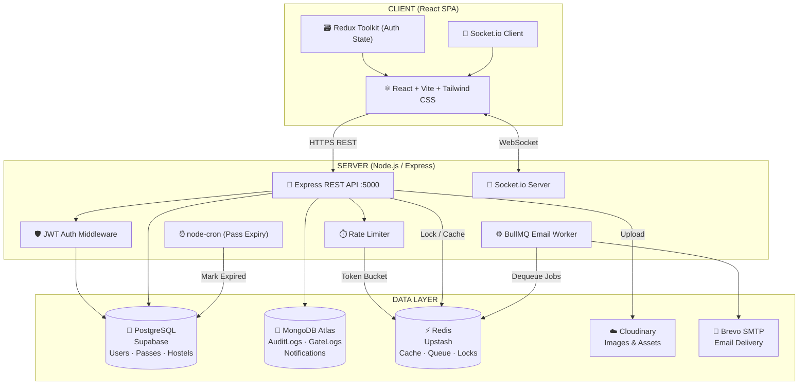
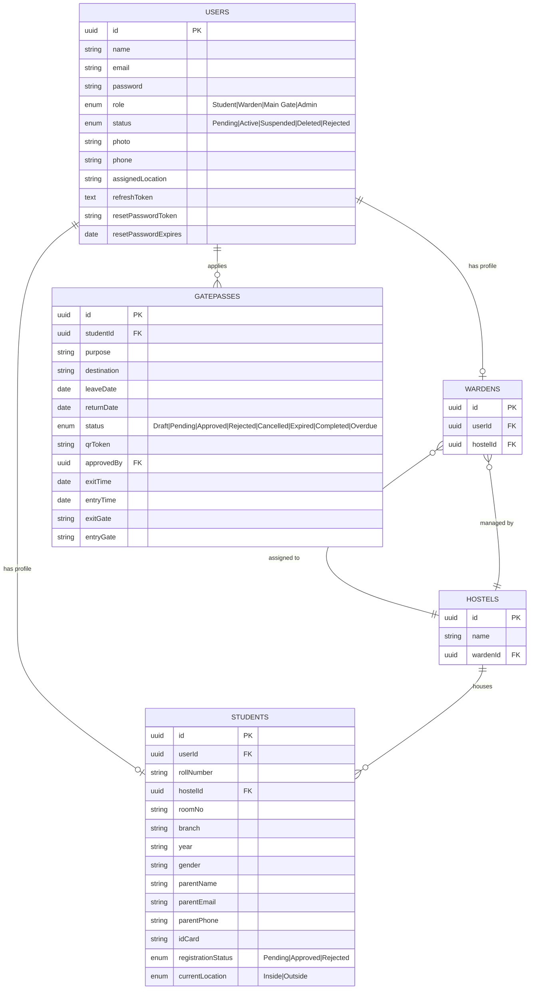
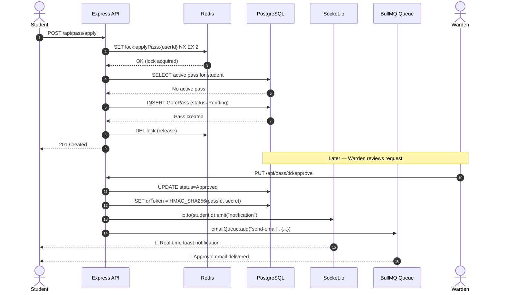
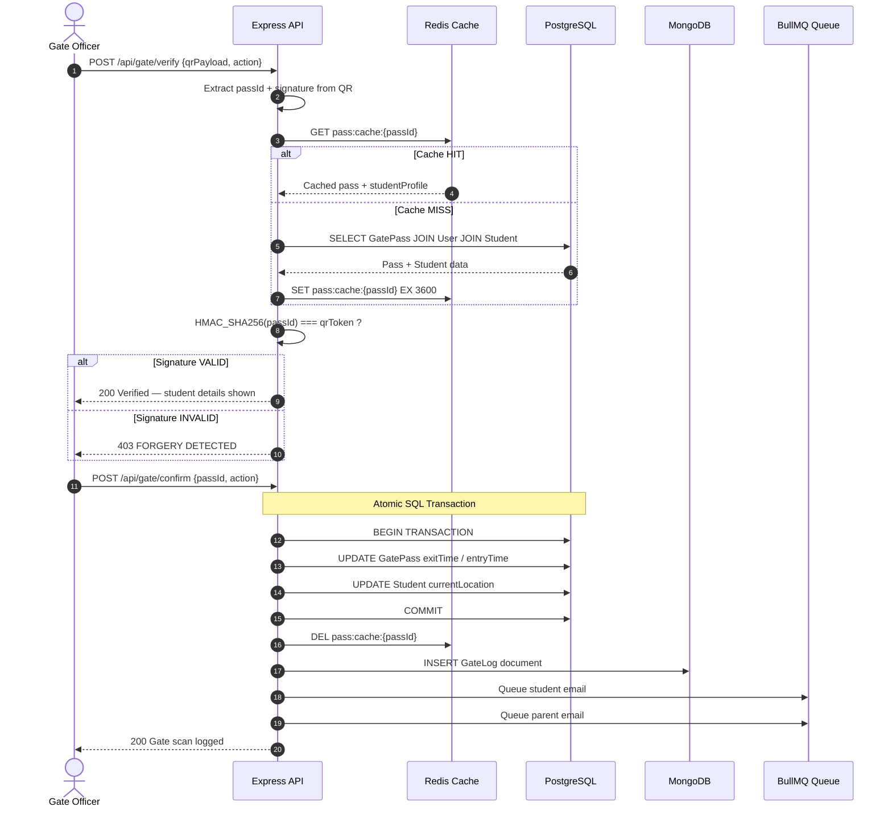
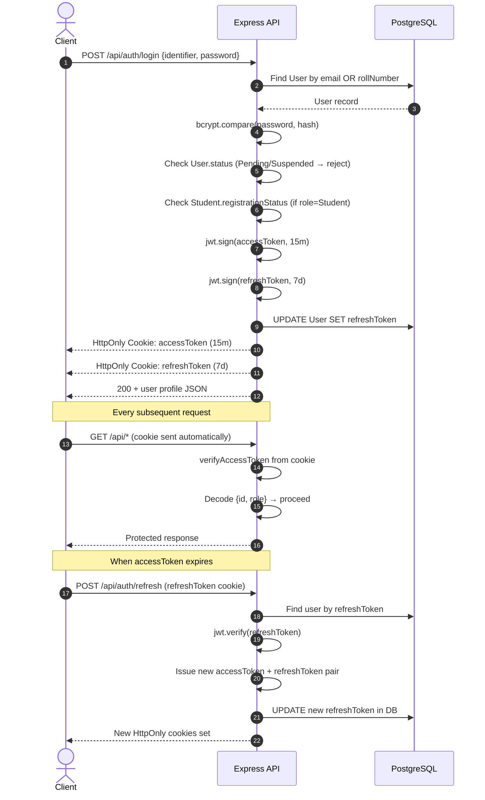
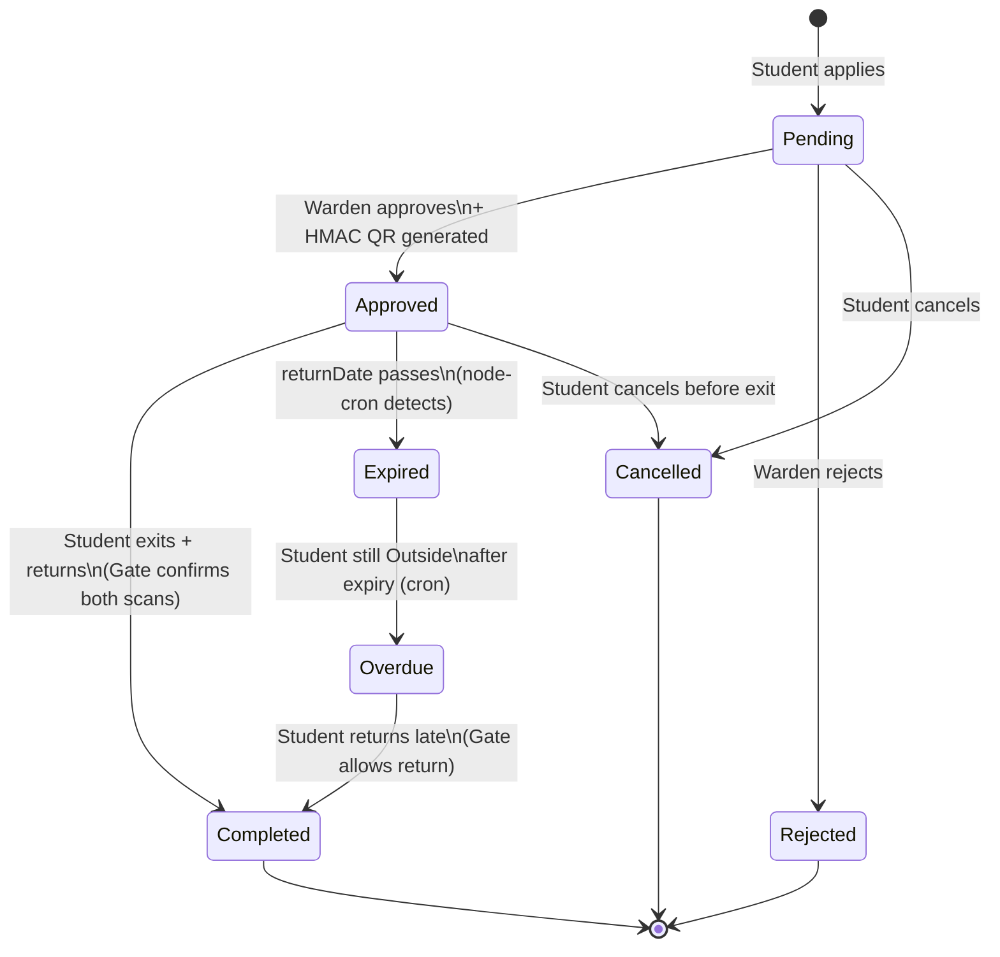
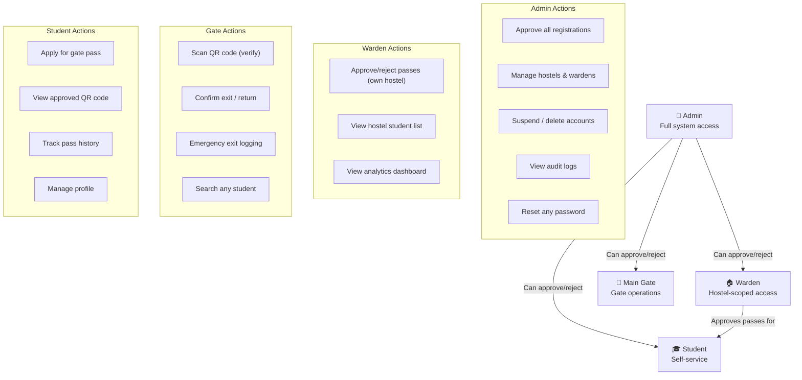
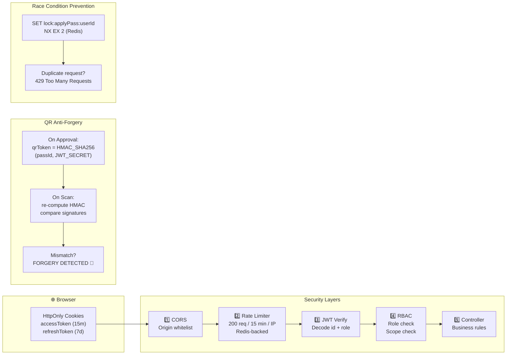
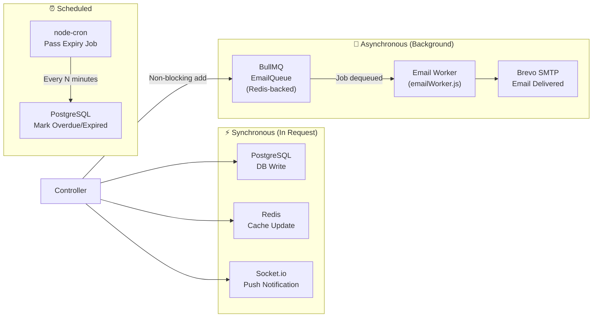

# CampusPass 🎓

<div align="center">


**A full-stack, production-grade digital outpass management system for NIT Hamirpur hostels.**

*Replacing paper passes with QR codes, real-time tracking, and automated parent notifications.*

</div>

---

## 📖 Overview

**CampusPass** is a secure, real-time digital gate pass system that manages student exits and re-entries at NIT Hamirpur hostels. It replaces the traditional paper-based outpass system with a cryptographically verified QR code workflow, complete with automated email notifications, audit trails, and live dashboards for wardens and administrators.

### The Problem
- Paper passes are slow, manual, and prone to forgery
- No real-time tracking of student location (Inside/Outside campus)
- Parents have no visibility when students leave campus
- No audit trail or accountability

### The Solution
- Students apply for passes online with departure and return details
- Hostel Wardens digitally approve/reject passes
- Approved passes generate a **cryptographically signed QR code** (HMAC-SHA256)
- Main Gate security scans QR to verify and log **exit and return**
- Parents receive **automatic email alerts** on every gate scan
- All admin actions are logged in an immutable **audit trail**

---

## ✨ Features

### For Students
- 📝 Apply for gate passes with purpose, destination, and dates
- 📱 View QR code for approved passes
- 🔔 Real-time notifications when pass is approved/rejected
- 📋 Full pass history with status tracking
- 👤 Profile with department, hostel, room, and emergency contacts

### For Wardens
- ✅ Approve or reject student pass requests with remarks
- 🏠 Hostel-scoped view (only see students from assigned hostel)
- 📊 Analytics dashboard with pass statistics
- 👥 Student list with real-time Inside/Outside status

### For Main Gate
- 📷 QR code scanner for instant pass verification
- 🔐 HMAC-SHA256 forgery detection
- 🚨 Emergency exit logging (bypasses warden approval)
- 🔍 Search students by roll number, name, or email

### For Admins
- 👤 Approve/reject Warden and Main Gate registrations
- 🏛️ Manage hostels and warden assignments
- 🔒 Suspend, activate, or delete accounts
- 📜 Immutable audit logs for all admin actions
- 🔑 Force-reset passwords for any user

---

## 🛠️ Tech Stack

### Backend

| Technology | Version | Purpose |
|---|---|---|
| **Node.js + Express.js** | ^5.2.1 | HTTP server and REST API |
| **PostgreSQL (Supabase)** | Cloud | Primary relational DB — Users, Passes, Hostels |
| **MongoDB Atlas** | Cloud | Secondary DB — Audit logs, Gate logs, Notifications |
| **Sequelize ORM** | ^6.37.8 | PostgreSQL model definitions and associations |
| **Redis (Upstash)** | Cloud | Caching, rate limiting, distributed locks |
| **BullMQ** | ^6.0.5 | Async email job queue backed by Redis |
| **Socket.io** | ^4.8.3 | Real-time WebSocket push notifications |
| **JWT (jsonwebtoken)** | ^9.0.3 | Access token (15m) + Refresh token (7d) auth |
| **bcrypt** | ^6.0.0 | Password hashing with salt rounds 10 |
| **Multer + Cloudinary** | ^2.2.0 / ^2.10.0 | File upload for photos and ID cards |
| **Nodemailer + Brevo** | ^9.0.3 | Transactional email delivery |
| **node-cron** | ^4.6.0 | Scheduled pass expiry job |
| **Helmet** | ^8.3.0 | HTTP security headers |

### Frontend

| Technology | Purpose |
|---|---|
| **React 18 + Vite** | Fast UI development and bundling |
| **React Router DOM v6** | Client-side routing |
| **Redux Toolkit** | Global authentication state |
| **Tailwind CSS v3** | Utility-first styling |
| **Framer Motion** | Smooth UI animations |
| **React Hook Form + Zod** | Form state management and validation |
| **qrcode.react** | Client-side QR code generation |
| **Axios** | HTTP client with cookie support |
| **Socket.io Client** | Real-time notification receiver |
| **Lucide React** | Icon library |

---

## 🏗️ System Architecture



---

## 🗄️ Database Schema



---

## 🔄 Pass Application Flow



---

## 🚪 Gate Verification Flow



---

## 🔐 Authentication Flow



---

## 🔁 Pass Lifecycle



---

## 👥 Role Hierarchy & Permissions



---

## 🔐 Security Architecture



---

## ⚡ Async Architecture



---

## 🚀 Installation

### Prerequisites
- Node.js v18+
- PostgreSQL / Supabase account
- MongoDB Atlas cluster
- Redis / Upstash account
- Cloudinary account
- Brevo (SMTP) account

### 1. Clone the repository
```bash
git clone https://github.com/aks-110/CampusPass.git
cd CampusPass
```

### 2. Install dependencies
```bash
cd server && npm install
cd ../client && npm install
```

### 3. Configure environment variables

Create `server/.env`:

```env
PORT=5000
NODE_ENV=development

JWT_SECRET=your_jwt_secret
JWT_REFRESH_SECRET=your_refresh_secret

MONGO_URI=mongodb+srv://<user>:<pass>@cluster.mongodb.net/campusPass

PG_URI=postgresql://<user>:<pass>@<host>:6543/postgres?pgbouncer=true

CLOUDINARY_CLOUD_NAME=your_cloud_name
CLOUDINARY_API_KEY=your_api_key
CLOUDINARY_API_SECRET=your_api_secret

REDIS_HOST=your-host.upstash.io
REDIS_PORT=6379
REDIS_PASSWORD=your_redis_password

SMTP_HOST=smtp-relay.brevo.com
SMTP_PORT=587
SMTP_USER=your_smtp_user
SMTP_PASS=your_smtp_password
SENDER_EMAIL=noreply@yourdomain.com

FRONTEND_URL=http://localhost:5173
```

### 4. Seed the first Admin
```bash
cd server
node seedSqlAdmin.js
```

### 5. Start development servers
```bash
# Terminal 1 — Backend
cd server && npm run dev

# Terminal 2 — Frontend
cd client && npm run dev
```

Frontend: `http://localhost:5173` | Backend: `http://localhost:5000`

---

## 📁 Project Structure

```
CampusPass/
├── client/                         # React + Vite frontend
│   ├── src/
│   │   ├── App.jsx                 # Routing + session restore
│   │   ├── layouts/
│   │   │   ├── AuthLayout.jsx      # Login/Register shell (hero + logo from Cloudinary)
│   │   │   └── MainLayout.jsx      # Protected app shell (sidebar + topbar)
│   │   ├── pages/                  # 31 role-specific page components
│   │   │   ├── Register.jsx        # Multi-step registration wizard
│   │   │   ├── StudentDashboard.jsx
│   │   │   ├── WardenPending.jsx   # Approval queue
│   │   │   ├── MainGateDashboard.jsx
│   │   │   ├── AdminDashboard.jsx
│   │   │   ├── VerifyPass.jsx      # Public QR viewer (no auth required)
│   │   │   └── ...
│   │   ├── redux/authSlice.js
│   │   ├── context/SocketContext.jsx
│   │   └── utils/axiosInstance.js
│   └── index.html
│
└── server/                         # Node.js + Express backend
    ├── index.js                    # App bootstrap + Socket.io + cron
    ├── config/
    │   ├── db.js                   # MongoDB connection
    │   ├── pg.js                   # PostgreSQL (Sequelize) connection
    │   ├── redis.js                # Redis client (cache + locks)
    │   ├── queue.js                # BullMQ EmailQueue
    │   └── multer.js               # Multer file upload config
    ├── models/
    │   ├── sql/                    # Sequelize models (5 tables)
    │   │   ├── User.js
    │   │   ├── Student.js
    │   │   ├── Pass.js
    │   │   ├── Hostel.js
    │   │   ├── Warden.js
    │   │   └── associations.js
    │   ├── AuditLog.js             # MongoDB — admin audit trail
    │   ├── GateLog.js              # MongoDB — gate scans (30d TTL)
    │   └── Notification.js         # MongoDB — per-user inbox
    ├── controllers/
    │   ├── authController.js       # Register, login, tokens, password reset
    │   ├── passController.js       # Apply, approve, reject, QR generation
    │   ├── gateController.js       # Verify QR, confirm scan, emergency exit
    │   ├── adminController.js      # User management, audit logs
    │   └── reportController.js     # Analytics aggregation
    ├── routes/                     # 7 Express route files
    ├── middlewares/
    │   ├── authMiddleware.js       # JWT protect + RBAC authorize
    │   ├── rateLimiter.js          # Redis-backed custom rate limiter
    │   └── auditMiddleware.js
    ├── utils/
    │   ├── jwtUtils.js             # Sign + verify access/refresh tokens
    │   ├── qrUtils.js              # HMAC-SHA256 QR signing/verification
    │   ├── cloudinary.js           # Cloudinary upload helper
    │   └── emailService.js         # Nodemailer + Brevo SMTP
    ├── workers/emailWorker.js      # BullMQ async email processor
    ├── cron/passExpiry.js          # node-cron pass expiry scheduler
    └── seedSqlAdmin.js             # Seed initial admin account
```

---

## 📡 API Reference

### Auth (`/api/auth`)

| Method | Endpoint | Auth | Description |
|---|---|---|---|
| POST | `/auth/register` | Public | Register (Student / Warden / Main Gate) |
| POST | `/auth/login` | Public | Login by email or roll number |
| POST | `/auth/logout` | Cookie | Clear session cookies |
| POST | `/auth/refresh` | Cookie | Issue new access token |
| GET | `/auth/me` | Protected | Get current user profile |
| PUT | `/auth/change-password` | Protected | Change own password |
| PUT | `/auth/update-profile` | Protected | Update phone/profile |
| POST | `/auth/forgot-password` | Public | Send password reset link |
| POST | `/auth/reset-password/:token` | Public | Reset password with token |

### Gate Passes (`/api/pass`)

| Method | Endpoint | Auth | Description |
|---|---|---|---|
| POST | `/pass/apply` | Student | Apply for a gate pass |
| GET | `/pass` | All roles | Get passes (role-scoped) |
| PUT | `/pass/:id/approve` | Warden/Admin | Approve + generate QR token |
| PUT | `/pass/:id/reject` | Warden/Admin | Reject with remarks |
| DELETE | `/pass/:id` | Student/Admin | Delete pass |
| GET | `/pass/public/:token` | Public | Verify QR token (public) |

### Gate Operations (`/api/gate`)

| Method | Endpoint | Auth | Description |
|---|---|---|---|
| POST | `/gate/verify` | Main Gate | Verify QR (with Redis cache) |
| POST | `/gate/confirm` | Main Gate | Confirm exit/entry (SQL transaction) |
| POST | `/gate/emergency` | Main Gate | Create emergency pass + exit |
| GET | `/gate/logs` | Main Gate/Admin | Today's gate activity log |
| GET | `/gate/search` | Main Gate | Search student by roll/name/email |

### Admin (`/api/admin`)

| Method | Endpoint | Auth | Description |
|---|---|---|---|
| GET | `/admin/pending` | Admin/Warden | List pending registrations |
| PUT | `/admin/approve/:userId` | Admin/Warden | Approve user |
| PUT | `/admin/reject/:userId` | Admin/Warden | Reject user |
| POST | `/admin/create-admin` | Admin | Create admin account |
| GET | `/admin/users` | Admin/Warden | List all users |
| PUT | `/admin/users/:id/status` | Admin | Suspend / activate user |
| DELETE | `/admin/users/:id` | Admin | Hard delete user |
| PUT | `/admin/users/:id/reset-password` | Admin | Reset user password |
| GET | `/admin/audit-logs` | Admin | Last 100 audit log entries |

---

## 👥 User Roles

| Role | Registration | Key Capabilities |
|---|---|---|
| **Student** | Self-register + 2-stage approval | Apply for passes, view QR |
| **Warden** | Self-register + Admin approval | Approve/reject passes (hostel-scoped) |
| **Main Gate** | Self-register + Admin approval | Scan QR, log exit/entry, emergency exits |
| **Admin** | Seeded or created by Admin | Full system access, audit logs |

### Two-Stage Student Approval
```
Student registers
  → User.status = Pending      (cannot log in)
  → Student.registrationStatus = Pending  (cannot apply for passes)
  → Admin approves  → User.status = Active
  → Warden approves → Student.registrationStatus = Approved
  → Student can now log in and apply for passes ✅
```

---

## 🏫 NIT Hamirpur Departments

> Computer Science & Engineering · Civil Engineering · Electrical Engineering · Mechanical Engineering · Electronics & Communication Engineering · Chemical Engineering · Material Science & Engineering · Architecture · Physics & Photonics Science · Chemistry · Mathematics & Scientific Computing · Humanities & Social Sciences · Management Studies · Centre For Energy Studies

## 🏠 NIT Hamirpur Hostels

> **Boys:** Kailash · Himgiri · Udaygiri · Neelkanth · Dhauladhar · Vindhyachal · Shivalik
>
> **Girls:** Ambika · Parvati · Mani-Mahesh · Aravali · Satpura

---

## 🤝 Contributing

1. Fork the repository
2. Create a feature branch: `git checkout -b feature/my-feature`
3. Commit your changes: `git commit -m 'Add my feature'`
4. Push to the branch: `git push origin feature/my-feature`
5. Open a Pull Request

---

## 📄 License

This project is licensed under the **ISC License**.

---

<div align="center">
  <strong>Built with ❤️ for NIT Hamirpur 🎓</strong><br/>
  <em>Digitizing campus outpass management — one QR code at a time.</em>
</div>